# QBox Platform — Database Entity & Relationship Specification

Covers the core relational schema backing the flows in [flows.md](./flows.md) and the
contracts in [contracts.md](./contracts.md). Designed for PostgreSQL (row-level locking,
`SELECT ... FOR UPDATE`, partial/unique indexes, `CHECK` constraints, native `ENUM` or
`CHECK`-backed status columns).

## How to preview

Same as [flows.md](./flows.md) — the ERD below is a standard Mermaid `erDiagram` block,
renderable in VS Code (Markdown Preview Mermaid Support extension), natively on
GitHub/GitLab, or via `mmdc -i database.md -o database.svg`.

---

## 1. Entity Relationship Diagram

```mermaid
erDiagram
    ROLES ||--o{ USERS : "assigned to"
    USERS ||--o| SPL_ADDRESSES : "primary address"
    USERS ||--o{ INSTALLATION_JOBS : "requests (as customer)"
    USERS ||--o{ TECHNICIAN_PROFILES : "is (if role=technician)"
    USERS ||--o{ APPROVAL_AUDIT_LOG : "reviewed by (superadmin)"
    USERS ||--o{ APPROVAL_AUDIT_LOG : "subject of"

    SPL_ADDRESSES ||--o{ INSTALLATION_JOBS : "install location"

    TECHNICIAN_PROFILES ||--o{ INSTALLATION_JOBS : "dispatched to"
    TECHNICIAN_PROFILES ||--o{ DIAGNOSTIC_LOGS : "performed by"

    HARDWARE_INVENTORY ||--o| INSTALLATION_JOBS : "reserved for / installed via"
    HARDWARE_INVENTORY ||--o{ DIAGNOSTIC_LOGS : "diagnosed"
    HARDWARE_INVENTORY ||--o| LOCKER_SUBSCRIPTIONS : "activates"
    HARDWARE_INVENTORY ||--o{ HARDWARE_STATUS_HISTORY : "transitions"

    INSTALLATION_JOBS ||--o{ DIAGNOSTIC_LOGS : "produces"
    INSTALLATION_JOBS ||--o{ JOB_STATUS_HISTORY : "transitions"
    INSTALLATION_JOBS ||--o| INSTALLATION_PROOF : "closed with"

    USERS ||--o{ LOCKER_SUBSCRIPTIONS : "owns"
    LOCKER_SUBSCRIPTIONS ||--o{ SUBSCRIPTION_INVOICES : "billed via"

    USERS {
        uuid id PK
        uuid role_id FK
        string account_type "HOMEOWNER | MERCHANT | SUPERADMIN | FACTORY_ADMIN | TECHNICIAN"
        string full_name
        string email UK
        string phone_number UK
        string password_hash
        string business_name "nullable, merchant only"
        string commercial_registration_number "nullable, merchant unique"
        string national_id "nullable, homeowner unique"
        uuid primary_address_id FK "nullable"
        string status "DRAFT|PENDING_APPROVAL|APPROVED|REJECTED|SUSPENDED|DEACTIVATED"
        string rejection_reason "nullable"
        uuid approved_by FK "nullable, -> users.id"
        timestamptz approved_at "nullable"
        timestamptz created_at
        timestamptz updated_at
    }

    ROLES {
        uuid id PK
        string name UK "HOMEOWNER|MERCHANT|SUPERADMIN|FACTORY_ADMIN|TECHNICIAN"
        jsonb permissions
        timestamptz created_at
    }

    SPL_ADDRESSES {
        uuid id PK
        uuid user_id FK
        string short_address "4 letters + 4 digits"
        string building_number
        string street_name
        string district
        string city
        string postal_code
        string additional_code
        string unit_number "nullable"
        numeric latitude "8,6"
        numeric longitude "9,6"
        boolean is_verified
        timestamptz created_at
        timestamptz updated_at
    }

    HARDWARE_INVENTORY {
        uuid id PK
        string serial_number UK "QBX-XXXXXXXXXX"
        string mac_address UK
        string model_code
        string firmware_version
        string status "IN_INVENTORY|STAGED|ASSIGNED|PROVISIONING|DIAGNOSTICS|ACTIVE|MAINTENANCE|DEFECTIVE|QUARANTINED|DECOMMISSIONED"
        uuid warehouse_id FK "nullable"
        uuid current_job_id FK "nullable, -> installation_jobs.id"
        uuid active_owner_id FK "nullable, -> users.id"
        int version "optimistic concurrency token"
        timestamptz received_at
        timestamptz created_at
        timestamptz updated_at
    }

    HARDWARE_STATUS_HISTORY {
        uuid id PK
        uuid hardware_unit_id FK
        string from_status
        string to_status
        uuid changed_by FK "nullable -> users.id, null for system-driven"
        string reason "nullable"
        timestamptz created_at
    }

    TECHNICIAN_PROFILES {
        uuid id PK
        uuid user_id UK "FK -> users.id"
        string employee_code UK
        string skill_level "JUNIOR|SENIOR|LEAD"
        boolean is_available
        numeric current_lat "8,6 nullable"
        numeric current_lng "9,6 nullable"
        timestamptz last_location_at "nullable"
        timestamptz created_at
        timestamptz updated_at
    }

    INSTALLATION_JOBS {
        uuid id PK
        uuid requesting_user_id FK
        uuid spl_address_id FK
        uuid hardware_unit_id FK "nullable until assignment"
        uuid technician_id FK "nullable until assignment"
        uuid assigned_by FK "-> users.id, factory admin"
        string status "CREATED|SCHEDULED|IN_TRANSIT|IN_PROGRESS|DIAGNOSTICS_RUNNING|COMPLETED|FAILED_PROVISIONING|FAILED_DIAGNOSTIC|RESCHEDULED|CANCELLED"
        timestamptz scheduled_window_start "nullable"
        timestamptz scheduled_window_end "nullable"
        timestamptz checked_in_at "nullable"
        boolean geofence_override
        string geofence_override_reason "nullable"
        int diagnostic_attempt_count
        int provisioning_attempt_count
        timestamptz completed_at "nullable"
        timestamptz created_at
        timestamptz updated_at
    }

    JOB_STATUS_HISTORY {
        uuid id PK
        uuid job_id FK
        string from_status
        string to_status
        uuid changed_by FK "nullable -> users.id"
        string reason "nullable"
        timestamptz created_at
    }

    DIAGNOSTIC_LOGS {
        uuid id PK
        uuid job_id FK
        uuid hardware_unit_id FK
        uuid technician_id FK
        int run_number
        string check_type "SOLENOID_LOCK_CYCLE|DOOR_POSITION_SENSOR|STATUS_LED|ACOUSTIC_BUZZER|CAMERA_STREAM_PRIMARY|CAMERA_STREAM_SECONDARY|MQTT_CONNECTIVITY"
        string result "PASS|FAIL|TIMEOUT|SKIPPED"
        int latency_ms "nullable"
        jsonb metrics
        string error_code "nullable"
        string error_message "nullable"
        timestamptz started_at
        timestamptz completed_at "nullable"
        timestamptz created_at
    }

    INSTALLATION_PROOF {
        uuid id PK
        uuid job_id UK "FK -> installation_jobs.id"
        string proof_photo_url
        string signature_image_url
        string signed_by_name
        timestamptz captured_at
        timestamptz created_at
    }

    LOCKER_SUBSCRIPTIONS {
        uuid id PK
        uuid hardware_unit_id UK "FK -> hardware_inventory.id"
        uuid owner_user_id FK
        string plan_code
        string status "ACTIVE|PAST_DUE|CANCELLED|EXPIRED"
        timestamptz activated_at
        timestamptz current_period_end
        timestamptz created_at
        timestamptz updated_at
    }

    SUBSCRIPTION_INVOICES {
        uuid id PK
        uuid subscription_id FK
        numeric amount "10,2"
        string currency "SAR"
        string status "PENDING|PAID|FAILED|REFUNDED"
        timestamptz period_start
        timestamptz period_end
        timestamptz paid_at "nullable"
        timestamptz created_at
    }

    APPROVAL_AUDIT_LOG {
        uuid id PK
        uuid subject_user_id FK
        uuid reviewer_user_id FK
        string decision "APPROVED|REJECTED|SUSPENDED|REINSTATED"
        string reason "nullable"
        timestamptz created_at
    }
```



---

## 2. Table Notes, Constraints & Index Strategy

### `users`
- `UNIQUE (email)`, `UNIQUE (phone_number)`.
- `UNIQUE (commercial_registration_number) WHERE commercial_registration_number IS NOT NULL`
  — partial unique index, since only merchants populate it.
- `UNIQUE (national_id) WHERE national_id IS NOT NULL` — partial unique for homeowners.
- `CHECK (status IN ('DRAFT','PENDING_APPROVAL','APPROVED','REJECTED','SUSPENDED','DEACTIVATED'))`.
- `CHECK ((status = 'REJECTED') = (rejection_reason IS NOT NULL))` — a rejection must always
  carry a reason, and only a rejection may.
- Index: `(status, account_type)` — powers the Superadmin's pending-review queue and
  Factory Admin eligibility checks.
- `role_id` FK `ON DELETE RESTRICT` (a role in use cannot be deleted).

### `spl_addresses`
- `UNIQUE (short_address, building_number, additional_code)` — this triplet is the true SPL
  natural key; enforce it so the same physical unit can't be registered twice under
  different rows.
- Index: `(user_id)`.
- Consider a `GIST` index on `(latitude, longitude)` via `earthdistance`/`PostGIS` if
  proximity search (e.g., "nearest available technician") is needed later — out of scope
  for v1 but schema-compatible.
- `is_verified` is set once GPS coordinates are confirmed against the SPL lookup API, not
  merely regex-valid.

### `hardware_inventory`
- `UNIQUE (serial_number)`, `UNIQUE (mac_address)`.
- `CHECK (status IN ('IN_INVENTORY','STAGED','ASSIGNED','PROVISIONING','DIAGNOSTICS','ACTIVE','MAINTENANCE','DEFECTIVE','QUARANTINED','DECOMMISSIONED'))`.
- `version` column (integer, default 0) backs **optimistic concurrency control** — every
  UPDATE during reservation must include `WHERE id = :id AND version = :expected_version`
  and increment `version`; zero rows affected ⇒ conflict, caller retries.
- Partial unique index `UNIQUE (current_job_id) WHERE current_job_id IS NOT NULL` — a
  hardware unit can be actively tied to at most one open job at a time.
- Index: `(status)` — Factory Admin dashboard filters by `STAGED`/`READY_FOR_INSTALL`
  constantly; a partial index `WHERE status = 'STAGED'` is worth adding at scale.

### `hardware_status_history` / `job_status_history`
- Append-only audit tables, no updates/deletes (enforce via `REVOKE UPDATE, DELETE` at the
  DB role level, or a trigger).
- Index: `(hardware_unit_id, created_at)` / `(job_id, created_at)` for chronological replay.

### `technician_profiles`
- `UNIQUE (user_id)` — one profile per technician user.
- `UNIQUE (employee_code)`.
- Index: `(is_available)` — dispatch queries filter on availability first, then
  proximity/skill.

### `installation_jobs`
- `CHECK (status IN ('CREATED','SCHEDULED','IN_TRANSIT','IN_PROGRESS','DIAGNOSTICS_RUNNING','COMPLETED','FAILED_PROVISIONING','FAILED_DIAGNOSTIC','RESCHEDULED','CANCELLED'))`.
- `CHECK (scheduled_window_end IS NULL OR scheduled_window_end > scheduled_window_start)`.
- `CHECK ((geofence_override = false) OR (geofence_override_reason IS NOT NULL))`.
- Foreign key `hardware_unit_id` is nullable (job exists in `CREATED`/`SCHEDULED` before a
  unit is picked in some flows) but must be `NOT NULL` by the time status enters
  `IN_TRANSIT` — enforce with a `CHECK` using a status-conditional constraint or an
  application-layer invariant plus a periodic integrity check, since Postgres `CHECK`
  constraints can't easily express "NOT NULL if X" across nullable combinations without a
  trigger. Recommend a `BEFORE UPDATE` trigger for this invariant.
- Index: `(status, scheduled_window_start)` — technician mobile app and Factory Admin
  dashboard both query "my jobs today by status".
- Index: `(technician_id, status)`.
- Index: `(requesting_user_id)`.

### `diagnostic_logs`
- `CHECK (result IN ('PASS','FAIL','TIMEOUT','SKIPPED'))`.
- Index: `(job_id, run_number, check_type)` — supports "show me run #2's results" and
  overall-result recomputation.
- `metrics` is `jsonb` to accommodate heterogeneous per-check telemetry (camera fps/
  resolution vs. buzzer dB vs. lock-cycle latency) without schema churn.

### `installation_proof`
- `UNIQUE (job_id)` — one proof record per completed job.
- Enforce at application layer (or a trigger) that this row can only be inserted when the
  parent job's status is transitioning into `COMPLETED`.

### `locker_subscriptions`
- `UNIQUE (hardware_unit_id)` — one active subscription per physical unit at a time
  (add `WHERE status = 'ACTIVE'` partial unique if units can be re-subscribed across
  owners over their lifetime and history must be preserved).
- Index: `(owner_user_id, status)`.

### `approval_audit_log`
- Append-only. Index `(subject_user_id, created_at)`.
- `CHECK (decision IN ('APPROVED','REJECTED','SUSPENDED','REINSTATED'))`.

---

## 3. Transactional Boundary Rules

### 3.1 Atomic Hardware Reservation (prevents double-booking)

The single highest-risk race condition in the system: two Factory Admins simultaneously
assigning the same `STAGED` unit to two different jobs. Two acceptable strategies:

**Option A — Pessimistic lock (recommended for this workload; low contention, correctness-critical)**

```sql
BEGIN;

SELECT id, status, version
FROM hardware_inventory
WHERE id = :hardware_unit_id
FOR UPDATE;                          -- blocks concurrent reservers on this row

-- application checks status = 'STAGED' in code; if not, ROLLBACK and return 409

UPDATE hardware_inventory
SET status = 'ASSIGNED',
    current_job_id = :job_id,
    version = version + 1,
    updated_at = now()
WHERE id = :hardware_unit_id;

UPDATE installation_jobs
SET status = 'SCHEDULED',
    hardware_unit_id = :hardware_unit_id,
    technician_id = :technician_id,
    scheduled_window_start = :window_start,
    scheduled_window_end = :window_end,
    assigned_by = :factory_admin_id,
    updated_at = now()
WHERE id = :job_id
  AND status = 'CREATED';            -- guards against reassigning an already-scheduled job

INSERT INTO hardware_status_history (hardware_unit_id, from_status, to_status, changed_by, created_at)
VALUES (:hardware_unit_id, 'STAGED', 'ASSIGNED', :factory_admin_id, now());

INSERT INTO job_status_history (job_id, from_status, to_status, changed_by, created_at)
VALUES (:job_id, 'CREATED', 'SCHEDULED', :factory_admin_id, now());

COMMIT;
```

If the `UPDATE installation_jobs` affects 0 rows (job was already scheduled/cancelled by a
concurrent request), the whole transaction rolls back and the API returns `409 Conflict`.

**Option B — Optimistic concurrency (better for high-read, low-write dashboards)**

```sql
UPDATE hardware_inventory
SET status = 'ASSIGNED', current_job_id = :job_id, version = version + 1, updated_at = now()
WHERE id = :hardware_unit_id
  AND status = 'STAGED'
  AND version = :expected_version;
-- 0 rows affected => conflict; re-fetch current state and surface HardwareAssignmentResultDTO{status: "CONFLICT"}
```

Both options must run inside a single DB transaction that also updates
`installation_jobs`, so a crash between the two UPDATEs never leaves a unit `ASSIGNED` to a
job that is still `CREATED`, or vice versa.

### 3.2 Job Completion (multi-table atomic close-out)

Completing a job touches four tables and must be all-or-nothing:

```sql
BEGIN;

UPDATE installation_jobs
SET status = 'COMPLETED', completed_at = now(), updated_at = now()
WHERE id = :job_id AND status = 'DIAGNOSTICS_RUNNING';

UPDATE hardware_inventory
SET status = 'ACTIVE', active_owner_id = :owner_user_id, version = version + 1, updated_at = now()
WHERE id = :hardware_unit_id AND status = 'DIAGNOSTICS';

INSERT INTO installation_proof (job_id, proof_photo_url, signature_image_url, signed_by_name, captured_at)
VALUES (:job_id, :photo_url, :signature_url, :signed_by_name, now());

INSERT INTO locker_subscriptions (hardware_unit_id, owner_user_id, plan_code, status, activated_at, current_period_end)
VALUES (:hardware_unit_id, :owner_user_id, :plan_code, 'ACTIVE', now(), :period_end);

INSERT INTO hardware_status_history (hardware_unit_id, from_status, to_status, changed_by, created_at)
VALUES (:hardware_unit_id, 'DIAGNOSTICS', 'ACTIVE', :technician_user_id, now());

INSERT INTO job_status_history (job_id, from_status, to_status, changed_by, created_at)
VALUES (:job_id, 'DIAGNOSTICS_RUNNING', 'COMPLETED', :technician_user_id, now());

COMMIT;
```

Both leading `UPDATE`s are guarded by a status-equality predicate so the transaction is a
no-op (and should be rolled back / surfaced as a conflict) if either row already moved on —
e.g. a duplicate mobile-app submit-retry after a network blip (mitigated primarily by the
`Idempotency-Key` at the API layer, with this predicate as defense-in-depth).

### 3.3 Diagnostic Failure → Hardware Defective

```sql
BEGIN;

UPDATE installation_jobs
SET status = 'FAILED_DIAGNOSTIC', updated_at = now()
WHERE id = :job_id AND status = 'DIAGNOSTICS_RUNNING';

UPDATE hardware_inventory
SET status = 'DEFECTIVE', current_job_id = NULL, version = version + 1, updated_at = now()
WHERE id = :hardware_unit_id AND status = 'DIAGNOSTICS';

INSERT INTO hardware_status_history (...) VALUES (..., 'DIAGNOSTICS', 'DEFECTIVE', ...);
INSERT INTO job_status_history (...) VALUES (..., 'DIAGNOSTICS_RUNNING', 'FAILED_DIAGNOSTIC', ...);

COMMIT;
```

Releasing `current_job_id` here means the unit is fully decoupled from the job and free to
re-enter the RMA/repair pipeline independently of what happens to the job (which may itself
transition to `RESCHEDULED` with a *different* hardware unit).

### 3.4 User Approval (single-row + audit, always paired)

```sql
BEGIN;

UPDATE users
SET status = 'APPROVED', approved_by = :superadmin_id, approved_at = now(), updated_at = now()
WHERE id = :user_id AND status = 'PENDING_APPROVAL';

INSERT INTO approval_audit_log (subject_user_id, reviewer_user_id, decision, created_at)
VALUES (:user_id, :superadmin_id, 'APPROVED', now());

COMMIT;
```

Every state-changing decision on `users.status` is paired with an `approval_audit_log`
insert in the same transaction — the audit table is the compliance record and must never
diverge from the mutable `users.status` column.

### 3.5 General rules

- **Isolation level**: `READ COMMITTED` (Postgres default) is sufficient for all flows above
  because every critical mutation is guarded by an explicit `WHERE status = ...` predicate
  or a `FOR UPDATE` lock — this avoids lost updates without paying for `SERIALIZABLE`
  retry overhead platform-wide.
- **No cross-service 2PC**: MQTT/Edge-device communication is **not** part of any SQL
  transaction. The DB transaction only commits once the backend has synchronously confirmed
  the relevant device-side step (e.g., MQTT CONNACK received) via the API call the
  technician app makes *after* that step succeeds — the device and DB are kept eventually
  consistent through the job state machine, not distributed transactions.
- **Retry/backoff belongs to the caller**: DB predicates return "0 rows affected" on
  conflict rather than throwing; the service layer converts that into a typed `409`/`412`
  response so mobile/web clients can retry deliberately instead of the DB layer silently
  looping.
