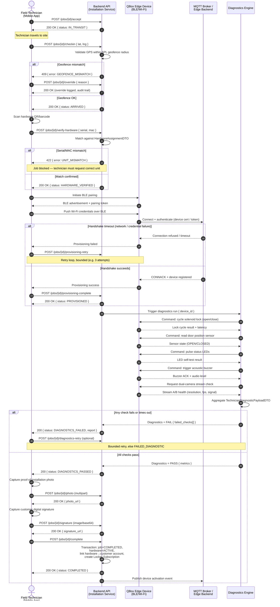
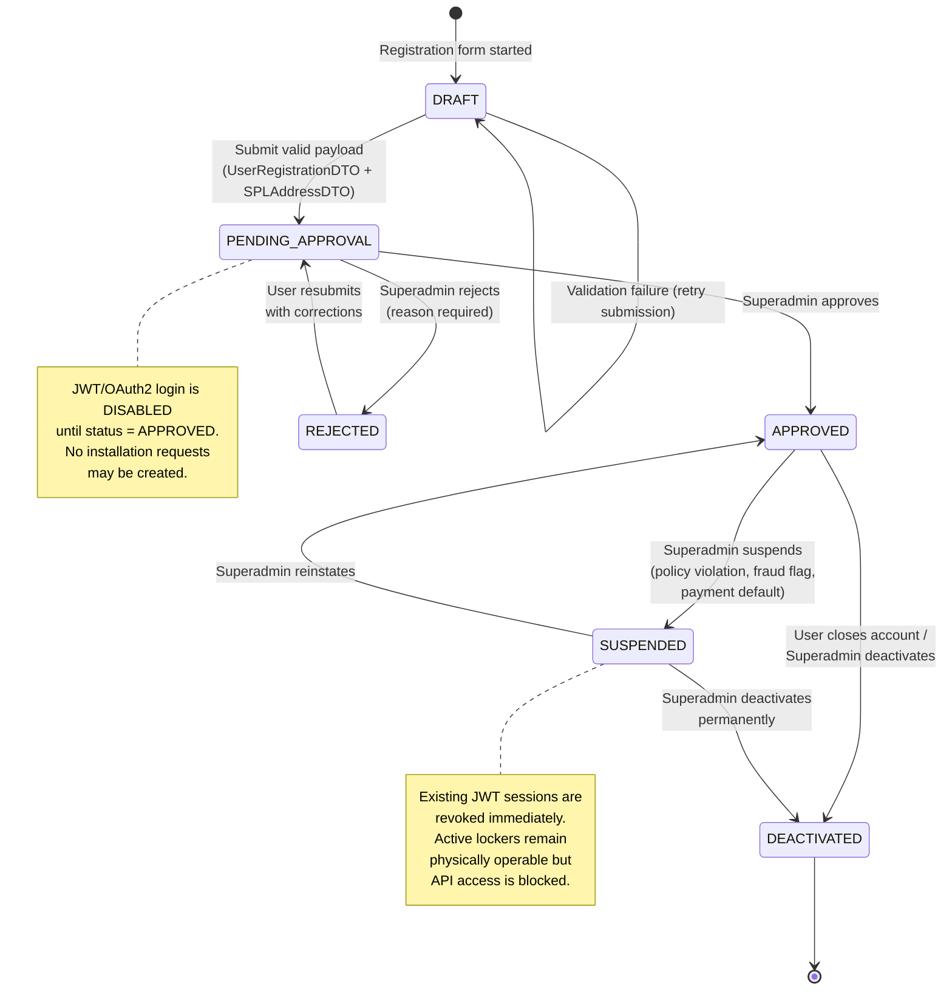
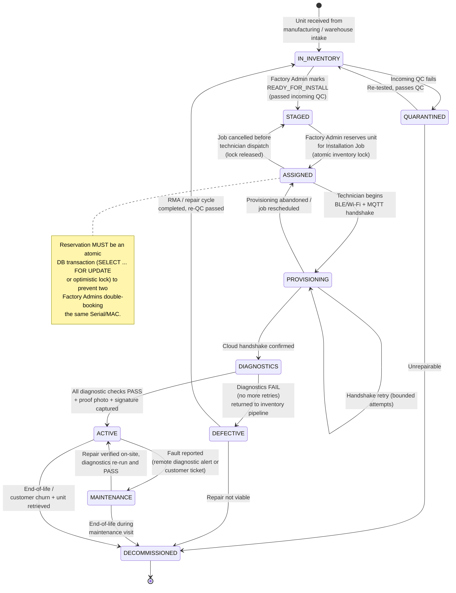
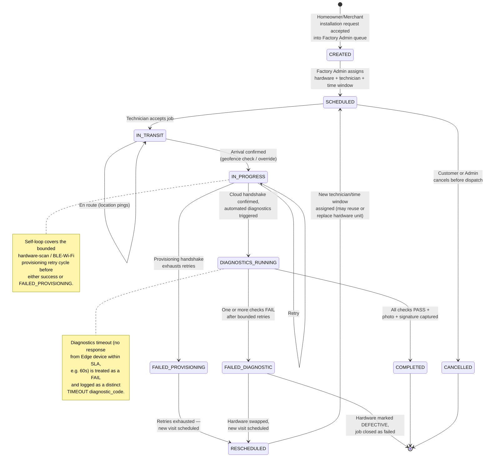

# QBox Platform — System Flow Diagrams

This document contains the production-grade Mermaid.js flow diagrams for the QBox Smart
Locker Platform. It covers the end-to-end system workflow across all five roles, the
technician installation execution sequence, and the three core state machines that govern
the platform: **User Account Lifecycle**, **Hardware Unit Lifecycle**, and
**Installation Job Lifecycle**.

## How to preview / render these diagrams

**Option A — VS Code (recommended for editing)**
1. Install the extension `bierner.markdown-mermaid` (or `Markdown Preview Mermaid Support`).
2. Open this file and run `Markdown: Open Preview` (`Ctrl+Shift+V` / `Cmd+Shift+V`).
3. Diagrams render inline as you edit.

**Option B — Compile to SVG/PNG via `@mermaid-js/mermaid-cli`**
```bash
npm install -g @mermaid-js/mermaid-cli

# Extract a single diagram block to its own .mmd file, then:
mmdc -i flow.mmd -o flow.svg -t neutral -b transparent

# Batch example: render every fenced mermaid block in this file (requires a small
# splitter script, or paste each block manually into its own .mmd file).
mmdc -i flows.md -o flows.svg -t neutral
```

**Option C — GitHub / GitLab**
Both render ```mermaid fenced blocks natively in the web UI — no setup required when
viewing this file in a pull request.

---

## 1. End-to-End System Workflow (All 5 Roles)

```mermaid
flowchart TD
    subgraph ONBOARD["Onboarding & Access Control"]
        direction TB
        A1([Homeowner / Merchant<br/>visits registration portal]) --> A2["Submit UserRegistrationDTO<br/>+ SPLAddressDTO"]
        A2 --> A3{SPL Address<br/>validation passes?}
        A3 -- "No — malformed Short Address,<br/>missing GPS coords" --> A4["Return 422<br/>ValidationError"]
        A4 --> A2
        A3 -- Yes --> A5["Create User<br/>status = PENDING_APPROVAL"]
        A5 --> A6[/Superadmin Review Queue/]
    end

    subgraph SUPERADMIN["Superadmin — Account Governance"]
        direction TB
        A6 --> S1{Superadmin decision}
        S1 -- Reject --> S2["status = REJECTED<br/>reason recorded"]
        S2 --> S3["Notify user via email/SMS"]
        S1 -- Approve --> S4["status = APPROVED<br/>OAuth2 client enabled"]
        S4 --> S5["Notify user: account active"]
    end

    S3 --> END1([End — user may re-apply])
    S5 --> B1

    subgraph REQUEST["Installation Request"]
        direction TB
        B1([Approved user logs in<br/>via JWT/OAuth2]) --> B2["Select verified SPL Address"]
        B2 --> B3["Create Installation Request<br/>status = QUEUED"]
        B3 --> B4[/Factory Admin Dashboard/]
    end

    subgraph FACTORY["Factory Admin / Inventory Manager"]
        direction TB
        B4 --> F1["View QUEUED requests"]
        F1 --> F2{Hardware unit<br/>READY_FOR_INSTALL<br/>available?}
        F2 -- No --> F3["Escalate to procurement /<br/>hold in QUEUED"]
        F3 --> F1
        F2 -- Yes --> F4["Reserve hardware unit<br/>(atomic lock, Serial/MAC bound)<br/>status = ASSIGNED"]
        F4 --> F5["Assign available Technician"]
        F5 --> F6["Set installation<br/>schedule window"]
        F6 --> F7["Order status = SCHEDULED<br/>Job status = CREATED → SCHEDULED"]
        F7 --> F8["Notify Technician (push/SMS)<br/>Notify Customer (confirmation)"]
    end

    F8 --> T1

    subgraph TECH["Field Technician — Mobile App"]
        direction TB
        T1([Technician accepts job]) --> T2["Job status = IN_TRANSIT"]
        T2 --> T3["Arrive on-site<br/>GPS geofence check vs SPL coords"]
        T3 --> T4{Geofence<br/>match?}
        T4 -- No --> T5["Flag anomaly,<br/>allow manual override + reason"]
        T5 --> T6
        T4 -- Yes --> T6["Scan hardware QR/barcode<br/>Serial + MAC validated vs assignment"]
        T6 --> T7{Matches<br/>assigned unit?}
        T7 -- No --> T8["Block install —<br/>report wrong-unit exception"]
        T8 --> T8R(["⟲ Routed back to Factory Admin<br/>queue for reassignment"])
        T7 -- Yes --> T9["BLE/Wi-Fi provisioning +<br/>MQTT broker handshake"]
        T9 --> T10{Handshake<br/>succeeded?}
        T10 -- "Timeout / failure" --> T11["Retry (max N) →<br/>else FAILED_PROVISIONING"]
        T11 --> T9
        T10 -- Yes --> T12["Run automated diagnostics<br/>(see sequence diagram)"]
        T12 --> T13{Diagnostics<br/>PASS?}
        T13 -- Fail --> T14["Log diagnostic fail report"]
        T14 --> T15{Retry?}
        T15 -- Yes --> T12
        T15 -- No --> T16["Job = FAILED_DIAGNOSTIC<br/>Hardware = DEFECTIVE<br/>returned to inventory"]
        T16 --> T16R(["⟲ Routed back to Factory Admin<br/>queue — hardware swap needed"])
        T13 -- Pass --> T17["Capture proof-of-install photo"]
        T17 --> T18["Capture customer<br/>digital signature"]
        T18 --> T19["Job status = COMPLETED"]
    end

    subgraph ACTIVATE["Platform Activation"]
        direction TB
        T19 --> C1["Hardware status = ACTIVE"]
        C1 --> C2["Link QBox unit to<br/>Homeowner/Merchant account"]
        C2 --> C3["Provision Locker Subscription"]
        C3 --> C4[/Customer notified —<br/>QBox ready to use/]
    end

    C4 --> END2([End])

    style ONBOARD fill:#eef2ff,stroke:#4f46e5
    style SUPERADMIN fill:#fef3c7,stroke:#b45309
    style REQUEST fill:#ecfeff,stroke:#0891b2
    style FACTORY fill:#f0fdf4,stroke:#15803d
    style TECH fill:#fdf2f8,stroke:#be185d
    style ACTIVATE fill:#f5f3ff,stroke:#6d28d9
```



---

## 2. Technician Installation Execution — Sequence Diagram



---

## 3. User Account Lifecycle — State Diagram



---

## 4. Hardware Unit Lifecycle — State Diagram



---

## 5. Installation Job Lifecycle — State Diagram



---

## 6. Edge-Case Reference

| Scenario | Where handled | Behavior |
|---|---|---|
| SPL address regex validation failure | Onboarding flow (§1), Contracts doc | 422 response, user must correct fields before `PENDING_APPROVAL` is created |
| GPS geofence mismatch at install site | Sequence diagram (§2), Job Lifecycle (§5) | Blocks default path; technician may log a manual override with a mandatory reason, fully audited |
| Wrong hardware unit scanned | Sequence diagram (§2) | Hard block — job cannot proceed; routed back to Factory Admin for reassignment |
| BLE/Wi-Fi provisioning timeout | Sequence diagram (§2), Hardware Lifecycle (§4) | Bounded retry (recommend 3 attempts with backoff); exhausted retries → `FAILED_PROVISIONING` |
| MQTT broker handshake rejected (bad cert/token) | Sequence diagram (§2) | Same retry policy as above; persistent failure escalates to Factory Admin / DevOps alert |
| Diagnostic check timeout (no Edge response) | Sequence diagram (§2), Job Lifecycle (§5) | Treated as FAIL with `diagnostic_code = TIMEOUT`; counts toward retry budget |
| Diagnostics fail after max retries | Job Lifecycle (§5), Hardware Lifecycle (§4) | `FAILED_DIAGNOSTIC`; hardware → `DEFECTIVE`; job → reschedule or terminal failure |
| Double-booking a hardware unit | Hardware Lifecycle (§4), Database doc | Prevented via atomic row-lock/optimistic-concurrency reservation at `ASSIGNED` transition |
| Superadmin rejects account | Account Lifecycle (§3) | User can resubmit with corrected data; no login/API access until `APPROVED` |
| Account suspended while hardware is `ACTIVE` | Account Lifecycle (§3) | API/app access revoked; physical locker keeps functioning offline-safe until reinstated or unit is decommissioned |
